# Smart Home Planner (Home Assistant App)

Plan, document, and visualize your smart home with a Home Assistant app that keeps everything organized. Data is stored in the app /data volume (included in Home Assistant backups), and the UI offers dashboards, advanced filters, and a device connection map. Devices, labels, areas, and floors sync automatically with Home Assistant.

## Features
- A quick dashboard that highlights what matters most in your smart home.
- Easy device list with search, filters, and a clear status overview.
- Simple forms to keep device details, notes, and dates in one place.
- Organize everything by floors and areas.
- Visual map to see how devices are connected.
- Automatic Backup of the data using Home Assisteant Backup system.

## Installation

* Go to the **App Store**, click **⋮ → Repositories**, fill in  `https://github.com/smarthomecompared/smart-home-planner` and click **Add → Close** or click the **Add repository** button below, click **Add → Close** (You might need to enter the **internal IP address** of your Home Assistant instance first).

* Click on the Smart Home Planner App and press **Install** and wait till the app is installed.
* Start the app by going to **Info** and click **Start**
* Wait a few seconds and press **OPEN WEB UI**, you will now see the onboarding page.

## Screenshots

### Dashboard Overview
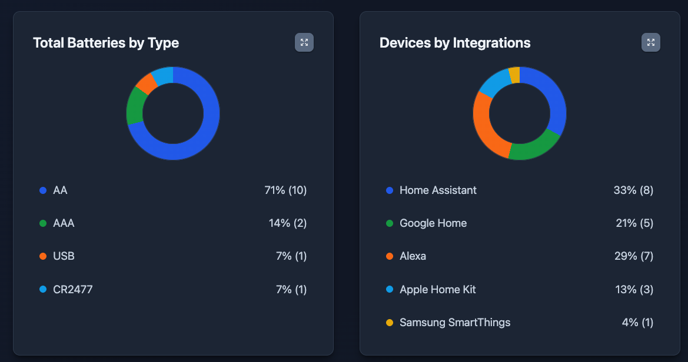
Track device, labels, areas, and floors at a glance. Get insights about the battery used, integrations, power usage, and more.

### Connection Diagram
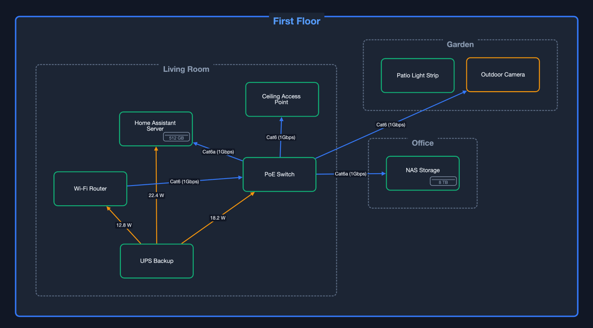
Visualize device placement and relationships across the home. Use it to plan expansions or share the layout with installers.

### Devices Table
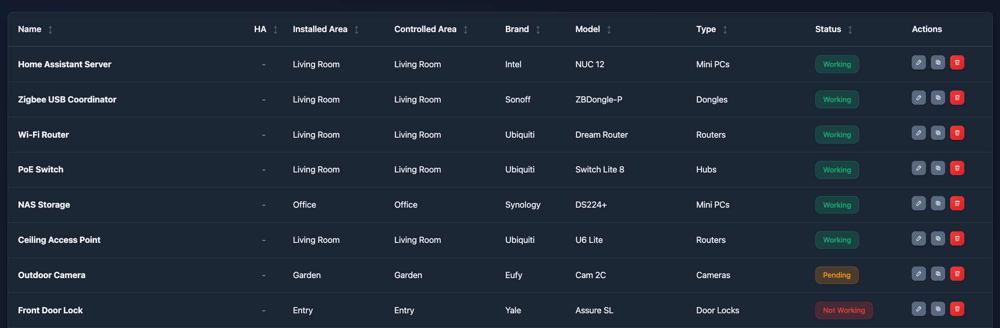
A dense, sortable inventory for power users. Scan essential details, multi-select devices, and jump straight into edits when you need to move fast.

### Devices Cards
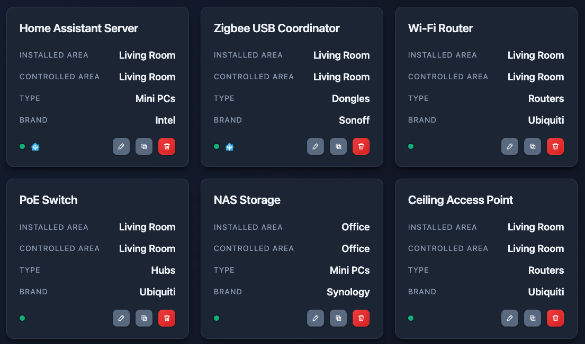
A readable card layout that works great on mobile and touch screens. Perfect for quick browsing, maintenance checks, and walkthroughs.

### Filters
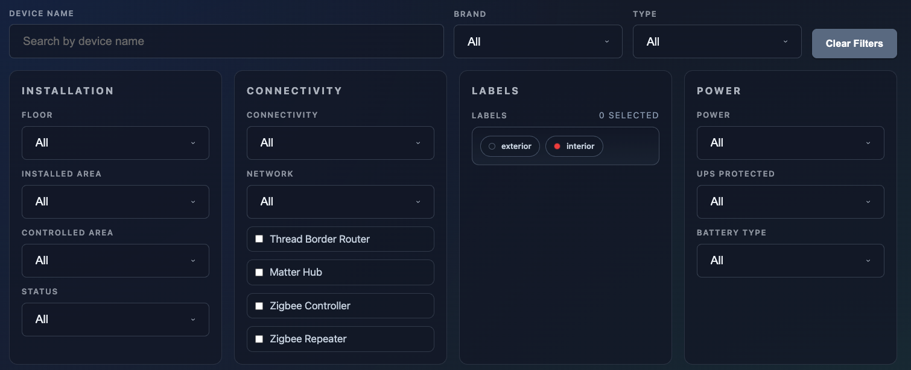
Slice the inventory by status, connectivity, labels, and integrations. Filters are optimized for quick audits and for finding the exact devices that need attention.

### Bulk Edit
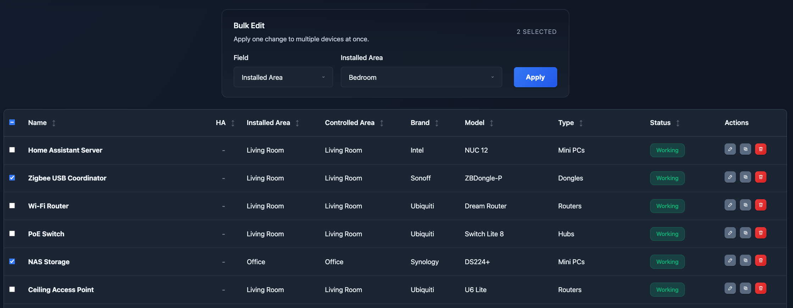
Apply a single change across many devices in seconds. Great for moving a batch to a new area or adding a shared label after installation.

### Device Basics
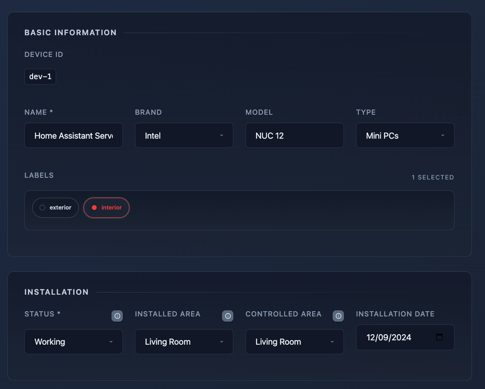
Capture identity, brand, type, and labels for each physical device. This becomes the canonical record even when integrations or platforms change.

### Device Power
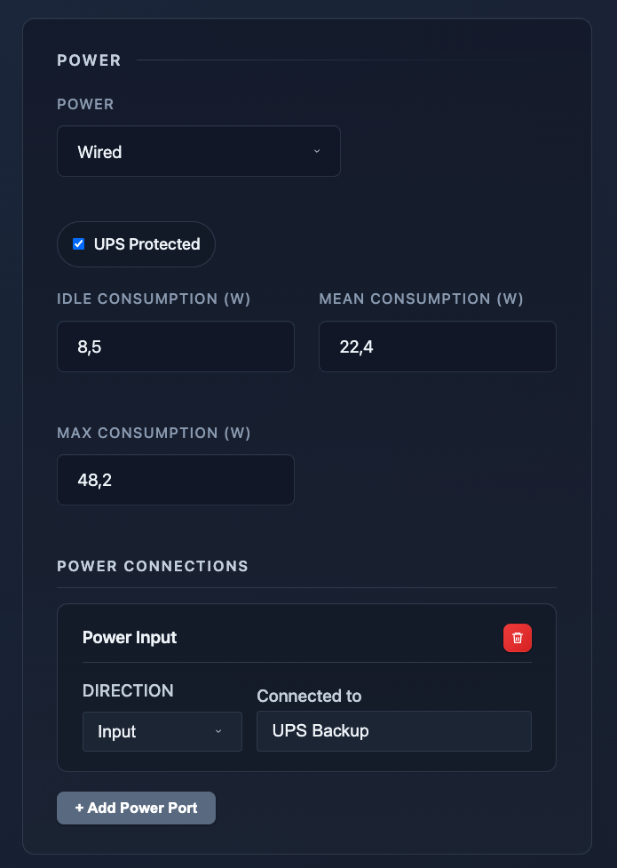
Document power source, battery types, and replacement cadence. Keep energy planning and maintenance schedules in one place.

### Device Ports
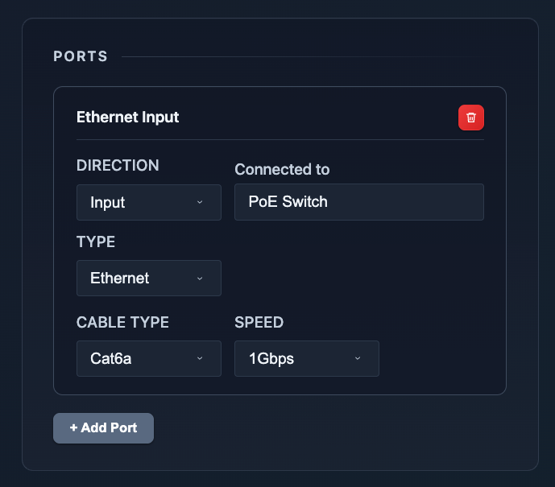
Map physical connections between devices. Build a living topology so it is clear how hubs, switches, and power sources are wired.

### Device Files
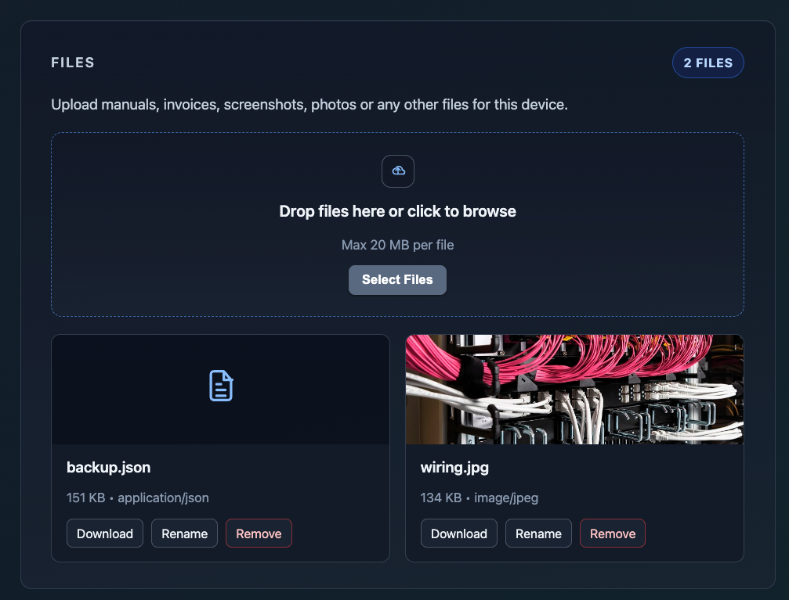
Attach manuals, invoices, photos, and setup notes to each device. Everything you need for maintenance and warranty stays with the record.

### Home Assistant Integration
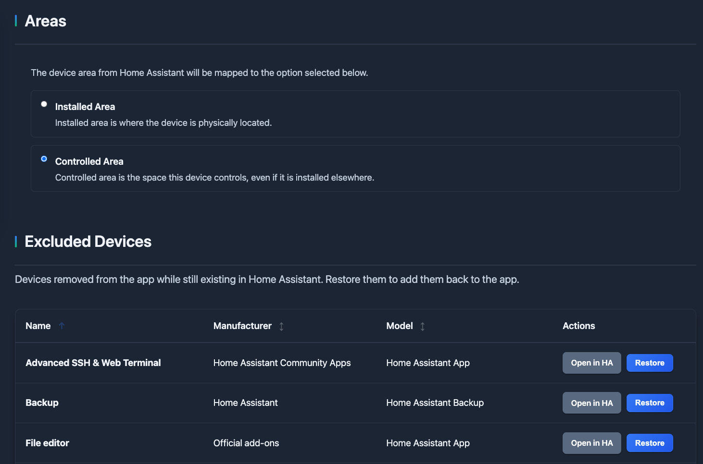
Sync devices, labels, areas and floors with Home Assistant while keeping the app focused on physical-device inventory and documentation.

### Networks
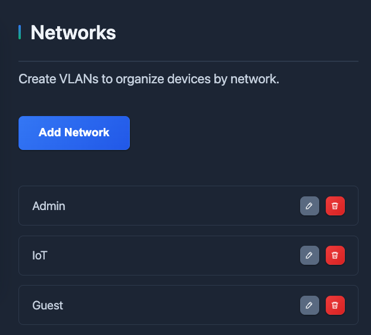
Document which VLAN each device uses so network assignments stay clear across the inventory.

## Follow Us

- X: https://x.com/shcompared
- YouTube: https://youtube.com/@SmartHomeCompared
- Instagram: https://instagram.com/smarthomecompared
- Reddit: https://www.reddit.com/user/smarthomecompared
- Stacker News: https://stacker.news/shcompared

## Other Products

- Smart Home Compared: Comparing the best Smart Home devices: thermostats, cameras, doorbells, lights, sensors, sirens, air quality monitors, smoke & CO alarms and more. https://smarthomecompared.com/
- Smart Home Deals: Discover the best smart home discounts across cameras, sensors, thermostats, doorbells, and more. Automatically filtered so you only see real price drops. https://smarthomedealsnow.com/
